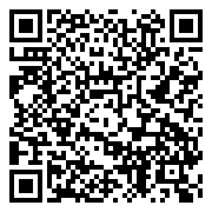

# Shadowrocket 配置文件

一份开箱即用的 Shadowrocket 规则配置，导入后添加自己的节点或订阅即可使用。

## 默认策略

| 服务 | 默认策略 | 可选策略 |
|------|----------|----------|
| 🧱 DNS 防泄露 | REJECT | 节点选择、DIRECT |
| 🛑 广告拦截 | REJECT | DIRECT、节点选择 |
| 🧩 自定义规则 | 🚀 节点选择 | PROXY、DIRECT、REJECT |
| 📧 邮件服务 | PROXY | DIRECT、节点选择、日本节点、香港节点 |
| 🔍 谷歌服务 | 🇺🇸 美国节点 | 🇯🇵 日本节点、🇭🇰 香港节点、节点选择、PROXY、DIRECT |
| 🤖 AI 服务 | 🇺🇸 美国节点 | 节点选择、PROXY、DIRECT |
| 🎬 流媒体 | 🚀 节点选择 | 新加坡/香港/日本/美国节点、PROXY、DIRECT |
| 💬 社交平台 | 🚀 节点选择 | 新加坡/香港/日本/美国节点、PROXY、DIRECT |
| 🍎 苹果推送 | 🚀 节点选择 | PROXY、DIRECT |
| 🍏 苹果服务 | DIRECT | 节点选择、PROXY |
| 🌍 非中国 | PROXY | 节点选择、DIRECT、日本节点 |
| 🐟 漏网之鱼 | PROXY | 节点选择、DIRECT、日本节点 |

## 快速开始

1. 复制配置文件的 Raw 链接：
   `https://raw.githubusercontent.com/fishingfish/AI-Works/refs/heads/main/Shadowrocket_fish.conf`
2. 打开 Shadowrocket → 配置 → 右上角 `+` → 粘贴链接 → 下载
3. 点击已下载的配置，设为使用中（✔️）
4. 首页添加你自己的节点或订阅
5. 连通性测试，选择可用节点连接

或者扫描二维码

## 分流规则

| 优先级 | 服务 | 默认策略 |
|--------|------|----------|
| 1 | 🧱 DNS 防泄露（HTTPDNS） | REJECT |
| 2 | 🧩 自定义规则（`Custom.list`） | 节点选择 |
| 3 | 🛑 广告拦截（AdvertisingLite） | REJECT |
| 4 | 📧 邮件服务（IMAP / POP3 / SMTP） | PROXY，可切换 DIRECT 或地区节点 |
| 5 | 🔍 谷歌服务（含 Gemini） | 美国节点，可手动切日本、香港节点 |
| 6 | 🤖 AI 服务（ChatGPT、Claude、Cursor 等） | 美国节点 |
| 7 | 🔒 哔哩哔哩 | DIRECT |
| 8 | 🏠 私有网络 / 局域网 | DIRECT |
| 9 | 🎬 流媒体（YouTube 含翻译 API、Netflix、Disney+、HBO、Hulu、Prime Video、Spotify 等） | 节点选择 |
| 10 | 💬 社交平台（Telegram、X、Facebook、Instagram、Discord、Reddit、TikTok 等） | 节点选择 |
| 11 | 🐱 代码托管（GitHub、GitLab、Atlassian） | 节点选择 |
| 12 | Ⓜ️ 微软服务 | 节点选择 |
| 13 | 🍎 苹果推送 | 节点选择 |
| 14 | 🍏 苹果服务 | DIRECT |
| 15 | 🔒 国内服务 | DIRECT |
| 16 | 🌍 非中国（境外流量） | PROXY |
| 17 | GEOIP CN | DIRECT |
| 18 | 🐟 漏网之鱼（兜底） | PROXY |

## 规则集来源

- [LingJingMaster/Shadowrocket-Rules](https://github.com/LingJingMaster/Shadowrocket-Rules) — 本仓库的基础，由其 fork/改写而来（MIT License，原版权声明保留在 `LICENSE`）
- [blackmatrix7/ios_rule_script](https://github.com/blackmatrix7/ios_rule_script) — 主要规则集
- [iab0x00/ProxyRules](https://github.com/iab0x00/ProxyRules) — AI 服务补充规则
- `Mail.list` 收录 Apple、Gmail、Outlook、Yahoo、Yandex 的邮件协议端点
- `Apple.list` 基于 blackmatrix7 Apple 规则，并配套加载 `Apple_Domain.list`，补充 iCloud Photos / Apple CDN 直连域名

## 当前重点

- 优化 DNS 防泄露
   - 代理域名默认通过代理访问 Cloudflare DoH，备用使用 Google DoH
   - 代理 DNS 不回退系统 DNS，避免代理域名查询从本地网络泄露
   - 直连域名使用系统 DNS，改善国内服务和 CDN 调度
   - 扩展常见硬编码 DNS 劫持范围
   - 新增 blackmatrix7 `BlockHttpDNS`，拦截 App 内置 HTTPDNS；微信 HTTPDNS 例外直连，保留国内 CDN 调度
- 新增 `Mail.list`
   - 精确收录常见 IMAP、POP3 与 SMTP 服务端点
   - 默认使用 PROXY，可手动切换 DIRECT 或地区节点
   - 补充富途交易相关域名：`futuapi.com`、`futuin.com`、`futuhk1.com`、`futuhongkong.com`、`qtlcdn.com`
   - 补充长桥交易相关域名：`lbkrs.com`、`longbridge.app`、`longportapp.com`
   - 合并 Arthur-vx Broker 规则中的精确 API / 交易域名、IP 段、TradeUP 和 Schwab 域名
   - 补充雪盈证券 / Snowball X 官方及 OpenAPI 域名
   - 补充盈透证券 / Interactive Brokers 官方域名
   - 美国运通因不同地区共用主域名，不纳入自动分流
- Google AI 相关规则已并入 `Google.list`
- `🔍 谷歌服务` 默认走日本节点，同时提供香港节点作为手动可选分区，便于在不同网络环境下切换。
- 新增 `ApplePush.list`
   - 将 Apple Push Notification service 相关域名优先归入 `🍎 苹果推送`
   - 改善 X、Telegram 等 App 在部分网络环境下无法及时收到推送的问题。
- 本仓库维护 `Apple.list`
   - 基于 blackmatrix7 的 Apple 规则
   - 配套加载 `Apple_Domain.list`，补齐完整 Apple 域名集
   - 补充 iCloud Photos、CloudKit、Apple CDN 相关域名，优化 iCloud 照片同步。

## 其他特性

- DNS：代理域名使用经代理转发的 Cloudflare / Google DoH，直连域名使用系统 DNS
- DNS 劫持：拦截常见硬编码 53 端口 DNS，防止应用绕过规则
- HTTPDNS 拦截：引用 blackmatrix7 `BlockHttpDNS`，阻止 App 通过内置 HTTPDNS 绕过系统解析；微信 HTTPDNS 前置直连，避免影响朋友圈和公众号图片的 CDN 调度
- 邮件分流：常见邮件协议端点默认使用 PROXY，可按网络情况切换直连或地区节点
- QUIC 屏蔽：对代理连接屏蔽 UDP/443，强制回退 HTTP/2
- 本地服务保护：`localhost.weixin.qq.com` 固定解析到 `127.0.0.1` 并强制直连，避免 fake-IP 影响微信本地回调
- TUN 直连优化：iCloud Photos / CloudKit / Apple CDN 域名使用系统 DNS 并跳过代理，保留 Apple Push 走代理
- Apple 分流一致性：Apple Push 域名与 TCP 5223 优先走苹果推送；`Apple.list` 与 `Apple_Domain.list` 共同覆盖其余 Apple 服务，避免因解析 IP 不同而在直连与代理间漂移
- 豆包服务：`doubao.com` 明确直连，避免语音及输入法接口因解析 IP 不同而改变出口
- DNS 上游：Cloudflare DoH 为主、Google DoH 为备用，均通过代理连接；代理解析不回退系统 DNS
- 局域网解析保护：`*.in-addr.arpa`、`*.ip6.arpa`、`*.local` 前置直连并交给系统解析，补充常见 DNS-SD 反查模式，避免 Bonjour / PTR 反查打到公共 DoH
- TUN 边界：保留 `198.18.0.0/15` 给 fake-IP / TUN 内部使用，不加入排除路由，私网桥接网段仍通过 `10.0.0.0/8`、`192.168.0.0/16` 等排除
- Apple 推送：默认走代理
   - `push.apple.com`
   - `gateway.push.apple.com`
   - `api.push.apple.com`
   - `sandbox.push.apple.com` 

## 注意事项

- 地区分组通过节点名称关键词自动匹配，请确保你的节点名称包含地区标识（如 🇭🇰、HK、香港等）
- 银行服务对出口 IP 和 VPN 环境较敏感，默认直连；如手动切换香港代理，建议尽量保持同一节点
- Google、AI、非中国和漏网之鱼的默认出口可在 App 内手动切换
- 如需 HTTPS 解密功能，请在 Shadowrocket 中生成并安装 CA 证书

## License

MIT

## 我的修改记录

- 加入 blackmatrix7 `AdvertisingLite` 去广告规则（策略组 `🛑 广告拦截`）
- 规则链接全部指向本仓库；新增 `Custom.list` 与策略组 `🧩 自定义规则`，个人规则写在这里
- 删除汇丰香港、香港银行相关规则
- 国内常见域名用阿里 DoH 解析（`[Host]`）
- 每周自动同步上游（`.github/workflows/sync-upstream.yml`），以 PR 形式合并
- 删除 `[URL Rewrite]` 与 `[MITM]`（google.cn 跳转及对应的 HTTPS 解密），不再使用 MITM
- `AI.list` 补充 Hugging Face、Cursor、Mistral、Character.AI、Poe、Midjourney、ElevenLabs、Suno
- 新增策略组 `🎬 流媒体`、`💬 社交平台`，规则来自 blackmatrix7 各服务规则集
- `Netflix.list`、`Facebook.list` 改为本仓库的精简版（域名 + IP-ASN），不再加载上游约 1100 / 570 条规则；这两份不随上游自动更新，条目参考 blackmatrix7/ios_rule_script 手工整理
- 删除券商服务相关规则（`HK_Broker.list` 与 `📈 券商服务` 策略组）
- 二维码换成本仓库的订阅地址（`qrcode.png`）
- 配置文件改名为 `Shadowrocket_fish.conf`，订阅地址与二维码同步更新
- 新增策略组 `🎮 游戏节点`（节点名含“游戏”），其余地区组、其他节点组都过滤掉含“游戏”的节点
- 取消 GitHub Actions 自动同步，改为由 AI 助手按 `CLAUDE.md` 的流程手动同步上游；新增 `scripts/check.py` 校验配置
- 合并策略组：`📲 电报消息` 并入 `💬 社交平台`，`📹 油管视频` 并入 `🎬 流媒体`
